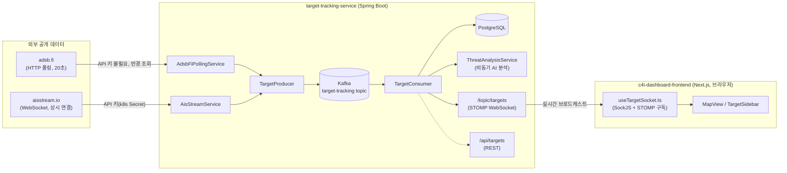

# 개념 정리 — 외부 실시간 데이터는 프론트가 아니라 백엔드가 부른다

"프론트에서 adsb.fi/aisstream.io를 직접 호출하는 건가, 아니면 우리 서버를 거치는 건가?"라는 질문에 답하려고 실제 코드를 다시 확인하고 정리한 기록. 결론: **프론트는 외부 API를 전혀 모른다.** 두 외부 소스 모두 `target-tracking-service`가 수신해서 기존 Kafka 파이프라인에 태우고, 프론트는 오직 우리 서버의 WebSocket/REST만 바라본다.

## 전체 흐름



## 왜 "프론트가 직접 부르지 않는다"가 맞는지 — 근거

코드베이스 전체에서 `adsb.fi`/`aisstream` 문자열을 찾아보면:

```
c4i-dashboard-frontend/src/components/TargetSidebar.tsx:80-81
  <a href="https://adsb.fi" target="_blank" ...>adsb.fi</a>
```

이게 프론트 쪽에서 나오는 유일한 참조이고, **실제 fetch/WebSocket 호출이 아니라 "데이터 출처: adsb.fi" 크레딧 링크**다. `aisstream`은 프론트 코드에 아예 등장하지 않는다.

반대로 프론트가 실제로 통신하는 대상은 `src/lib/config.ts`에 정의된 두 개뿐이다:

```ts
export const BACKEND_URL = ... ?? "https://k3s-master.taildcdcee.ts.net"; // 우리 서버
export const WS_URL = `${BACKEND_URL}/ws`;                                 // 우리 서버 STOMP 엔드포인트
```

`useTargetSocket.ts`는 이 `WS_URL`에 SockJS+STOMP로 붙어서 `/topic/targets`를 구독할 뿐, adsb.fi나 aisstream.io의 존재 자체를 모른다.

## 이렇게 설계한 이유

1. **API 키가 브라우저에 노출되지 않는다.** aisstream.io 키는 k8s Secret(`ais-stream-api-key`)으로 백엔드 파드 환경변수에만 존재한다. 프론트에서 직접 호출했다면 이 키가 번들에 박히거나 네트워크 탭에서 그대로 보였을 것.
2. **레이트리밋을 한 곳에서만 관리하면 된다.** adsb.fi는 "초당 1회" 제한이 있는데(`04-adsb-fi-live-feed-integration.md` 참고), 호출 주체가 브라우저 여러 개(사용자마다 각자 탭)였다면 한도를 지키는 게 사실상 불가능하다. 백엔드 폴링 하나로 모으니 사용자가 몇 명이든 외부에는 요청이 한 번만 나간다.
3. **기존 파이프라인(Kafka → PostgreSQL → AI 분석 → WebSocket)을 그대로 재사용할 수 있다.** ADS-B든 AIS든 `TargetEvent`로 변환해서 `TargetProducer.send()`만 호출하면, 저장·AI 위협분석·실시간 브로드캐스트가 전부 공짜로 따라온다 — 프론트가 소스별로 다른 처리를 할 필요가 없다.
4. **소스가 늘어나도 프론트는 코드 변경이 필요 없다.** AIS를 추가할 때 프론트 쪽 변경은 지도에 선박 아이콘을 어떻게 그릴지(`targetType === "SHIP"`)뿐이었고, 데이터를 어떻게 받아오는지는 전혀 건드리지 않았다.

## 관련 문서

- `docs/concepts/04-adsb-fi-live-feed-integration.md` — ADS-B 통합, 레이트리밋 처리
- `k3s-msa-infrastructure/docs/AIS-Ship-Tracking-Integration.md` — AIS 통합, 바이너리 프레임 디버깅
- `docs/wetsocket.md` — WebSocket(`/topic/targets`) 프로토콜 상세
